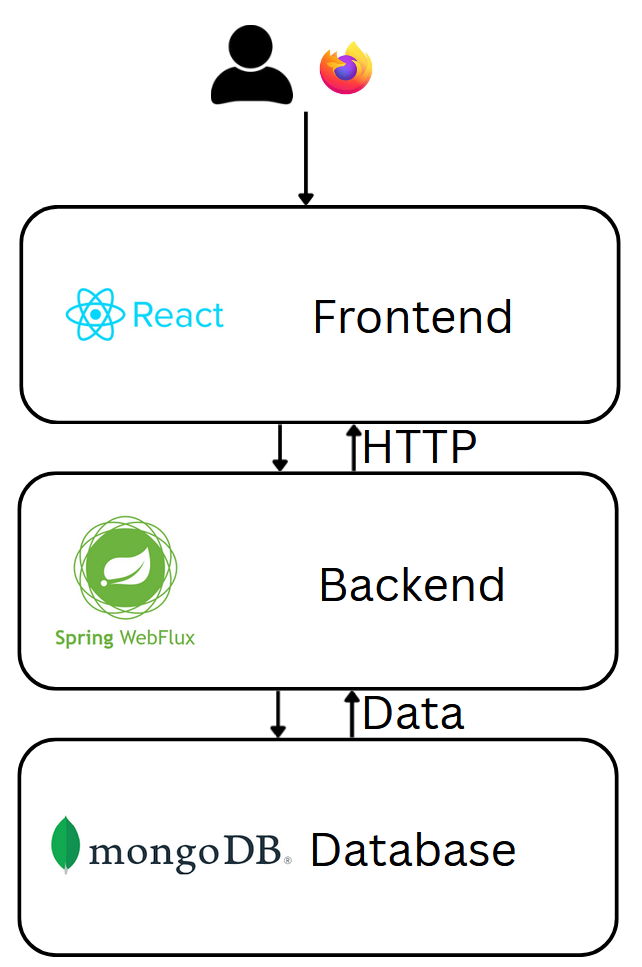

# DisciplineTracker

This repository will contain a discipline tracker make for my own use and to practice my programming skills.

The project is a basic low stimulation app to track your accomplishment of your activities.

## How it works

In this application the user one time it has yet create an account and has login can create the registers for the activities they want to track along the time.
In a first time, the user has to create the activity and at the same time, he can fill the firsts records.
In the home screen the user can see a graphic with the accompletision of this week and his activities and can toggle it as completed for today.
The activities screen allows the user to see the report of a activity monthly and yearly. The monthly view allows modifications of the records.
Finally in the user screen the user can see his data with some statistics to encourage the user to complete more activities daily.

## Project architecture



## Backend

### Structure
The backend is a WebFlux API with a layered structure separating controllers, services and access to the database to keep modular, scalable and simple structure. This application is a reactive API REST to manage the activities and tracks with non blocking operations.

### Data model
User: is the current user who uses the application.
Activity: represent a activity that we want to track.
ActivityTrack: represent the accompletision of a activity in a day.

### Endpoints
- GET /users/new endpoint to create a new user
- POST /users/login endpoint to login a user, returns a access token and a refresh token
- POST /users/login/refresh endpoint to refresh the current access token, you send the refresh token an the app returns a new access token
- GET /users/detail endpoint to get the details of the current logged user

- GET /activities endpoint to obtain all the activities without tracks
- POST /activities/new endpoint to create a new activity
- GET /activities/detail endpoint to get the details of the activities with his tracks, it can be monthly and yearly
- GET /activities/detail/{id} endpoint to get the details of a activity with his tracks, it can be monthly and yearly
- GET /activities/track/monthly endpoint to get the number of total tracks monthly
- POST /activities/track/new endpoint to submit new tracks, if you send a tracks existing in the database, it will be deleted

## Frontend

### Structure
The frontend has a component-based structure. In which we have several pages like Home, User, Activities, ActivityDetail, NewActivityForm, Register or Login and we use the components to complete this pages.

### Flow
Activities <- GET /activities
ActivityDetail <- GET /activities/detail/{id}?month={}&year={}
ActivityDetailByYear <- GET /activities/detail/{id}?year=
NewActivityForm -> POST /activities/new, POST /activities/track/new
Home <- GET /activities/detail?month=
Home -> POST /activities/track/new
Login -> POST /users/login
Profile <- GET /users/detail, GET /activities/detail?month=
Register -> POST /users/new

## Database
The database is a non relational database with non coupled data, we have the following models:

users
```
{
  "_id": "eff9006f-1998-4f01-8f5e-f322c9f56459",
  "username": "Guaje",
  "name": "Juan Jesús",
  "lastName": "Campos Garrido",
  "birthDate": {
    "$date": "2002-01-02T23:00:00.000Z"
  },
  "password": "$2a$10$.ZoARgwd6qtmVZ7/zWVTzePglVPgSgcSWo0drlEUm04tsCaCqnOWu",
}
```

activities
```
{
  "_id": "ec17ae2a-032e-49fc-8cdb-c86a097d3a2d",
  "name": "Gym",
  "userId": "eff9006f-1998-4f01-8f5e-f322c9f56459",
}
```

activity_track
```
{
  "_id": "be1186b3-1827-4fa4-bc7a-df10c293dde7",
  "activityId": "ec17ae2a-032e-49fc-8cdb-c86a097d3a2d",
  "date": {
    "$date": "2026-02-28T23:00:00.000Z"
  },
}
```

## Deployment

### Database
Start de mongoDb server

### Backend
Requirements: Java 25 and maven.
Fill this lines in application.ref.properties
jwt.secret=
jwt.access-expiration=
jwt.refresh-expiration=

Change de database URL in application.properties
spring.data.mongodb.uri=

run the command ./mvnw spring-boot:run

### Frontend
Fill the .env for the frontend with the url of the backend
VITE_API_URL=

run the command npm install
run the command npm run dev

## Testing
